# Proyecto Individual
# Arquitectura de Computadores I
# David Garcia Cruz - 2024115575

## 1. Descripción de la arquitectura del código y decisiones de diseño

La herramienta recibe una única instrucción por línea de comandos y genera
su palabra de instrucción de 32 bits. El archivo `encoder_skeleton.py` se
mantiene como punto principal de entrada y coordina los demás módulos.

La implementación se dividió de la siguiente manera:

| Archivo | Responsabilidad |
|---|---|
| `encoder_skeleton.py` | Entrada principal, selección del formato y salida `HEX`. |
| `instruction_set.py` | Tabla de instrucciones, opcode, funct3 y funct7. |
| `parser.py` | Parseo de instrucciones, registros y operandos de memoria. |
| `format_r.py` | Codificación de `add`, `sub`, `and` y `or`. |
| `format_i.py` | Codificación de `addi`, `andi`, `lw` y `lb`. |
| `format_s.py` | Codificación de `sw` y `sb`. |
| `format_b.py` | Codificación de `beq` y `bne`. |
| `explanation.py` | Desglose ASCII de los campos de cada instrucción. |
| `validate_toolchain.py` | Comparación automática contra GCC y `objdump`. |
| `run.sh` | Punto de entrada requerido por el enunciado. |

El codificador utiliza operaciones de desplazamiento (`<<`) y OR bit a bit
(`|`) para colocar cada campo en su posición dentro de la palabra. Los
registros se aceptan únicamente desde `x0` hasta `x31`.

También se validan los rangos de los inmediatos antes de aplicar la máscara
binaria. Los inmediatos de 12 bits aceptan valores de `-2048` a `2047`. Los
offsets de formato B aceptan valores pares de `-4096` a `4094`.

### Digrama de flujo de la herramienta
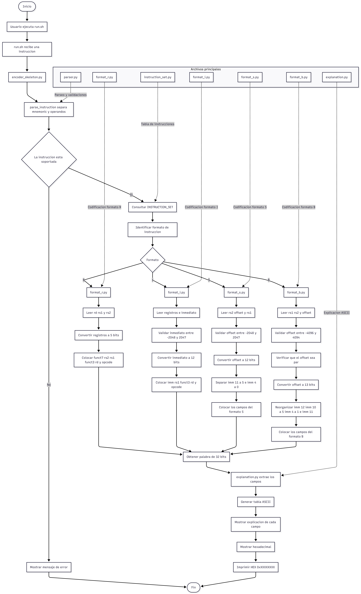

## 2. Fuentes consultadas para los campos de codificación

La fuente principal utilizada fue la RV32I Green Card:

[RV32I Green Card - CS 61C](https://notes.cs61c.org/content/misc/rv32i-green-card/)

La tabla consultada indica los siguientes campos:

| Instrucción | Tipo | Opcode | Funct3 | Funct7 |
|---|---|---|---|---|
| `add` | R | `0110011` | `000` | `0000000` |
| `sub` | R | `0110011` | `000` | `0100000` |
| `and` | R | `0110011` | `111` | `0000000` |
| `or` | R | `0110011` | `110` | `0000000` |
| `addi` | I | `0010011` | `000` | No aplica |
| `andi` | I | `0010011` | `111` | No aplica |
| `lw` | I | `0000011` | `010` | No aplica |
| `lb` | I | `0000011` | `000` | No aplica |
| `sw` | S | `0100011` | `010` | No aplica |
| `sb` | S | `0100011` | `000` | No aplica |
| `beq` | B | `1100011` | `000` | No aplica |
| `bne` | B | `1100011` | `001` | No aplica |

Las estructuras de bits utilizadas son:

```text
R: funct7 | rs2 | rs1 | funct3 | rd | opcode
I: imm[11:0] | rs1 | funct3 | rd | opcode
S: imm[11:5] | rs2 | rs1 | funct3 | imm[4:0] | opcode
B: imm[12|10:5] | rs2 | rs1 | funct3 | imm[4:1|11] | opcode
```

En todos los formatos, los registros ocupan 5 bits. El formato B separa el
inmediato porque el bit menos significativo siempre es cero: los branches
usan desplazamientos pares.

## 3. Ejemplos de salida explicativa

La herramienta muestra la instrucción, el formato, la cadena binaria de 32
bits y una tabla ASCII con cada campo.

### 3.1 Formato R

Entrada:

```bash
./run.sh "add x5, x6, x7"
```

Salida relevante:

```text
Formato: R

Cadena binaria completa [31:0]:
00000000011100110000001010110011

Campos de la instrucción:
+-------------+-----------+--------------+-------------------------------------------------------------------------+
| Campo       | Bits      | Binario      | Significado                                                             |
+-------------+-----------+--------------+-------------------------------------------------------------------------+
| funct7      | [31:25]   | 0000000      | funct7 identifica la variante de add.                                  |
| rs2         | [24:20]   | 00111        | rs2 = 7 (x7), segundo registro fuente.                                 |
| rs1         | [19:15]   | 00110        | rs1 = 6 (x6), primer registro fuente.                                  |
| funct3      | [14:12]   | 000          | funct3 identifica la operación dentro del opcode.                      |
| rd          | [11:7]    | 00101        | rd = 5 (x5), registro destino.                                         |
| opcode      | [6:0]     | 0110011      | opcode identifica una instrucción aritmética de formato R.             |
+-------------+-----------+--------------+-------------------------------------------------------------------------+
HEX: 0x007302b3
```

### 3.2 Formato I

Entrada:

```bash
./run.sh "addi x5, x6, -12"
```

El inmediato `-12` se representa en complemento a dos usando 12 bits:

```text
-12 = 111111110100
```

Esos bits se colocan en las posiciones `[31:20]`.

```text
[31:20]          [19:15] [14:12] [11:7] [6:0]
111111110100     rs1     funct3  rd     opcode
```

Salida completa:

```text
Instrucción: addi x5, x6, -12
Formato: I

Cadena binaria completa [31:0]:
11111111010000110000001010010011

Campos de la instrucción:
+-------------+-----------+--------------+-------------------------------------------------------------------------+
| Campo       | Bits      | Binario      | Significado                                                             |
+-------------+-----------+--------------+-------------------------------------------------------------------------+
| imm[11:0]   | [31:20]   | 111111110100 | imm[11:0] = -12. Es el inmediato en complemento a dos.                 |
| rs1         | [19:15]   | 00110        | rs1 = 6 (x6), registro fuente o base.                                  |
| funct3      | [14:12]   | 000          | funct3 identifica la operación o el tamaño de la carga.                |
| rd          | [11:7]    | 00101        | rd = 5 (x5), registro destino.                                         |
| opcode      | [6:0]     | 0010011      | opcode identifica una instrucción de formato I.                        |
+-------------+-----------+--------------+-------------------------------------------------------------------------+
HEX: 0xff430293
```

### 3.3 Formato S

Entrada:

```bash
./run.sh "sw x8, -4(x2)"
```

El inmediato se convierte a 12 bits y se divide en dos partes:

```text
imm[11:5] -> bits [31:25]
imm[4:0]  -> bits [11:7]
```

Salida completa:

```text
Instrucción: sw x8, -4(x2)
Formato: S

Cadena binaria completa [31:0]:
11111110100000010010111000100011

Campos de la instrucción:
+-------------+-----------+--------------+-------------------------------------------------------------------------+
| Campo       | Bits      | Binario      | Significado                                                             |
+-------------+-----------+--------------+-------------------------------------------------------------------------+
| imm[11:5]   | [31:25]   | 1111111      | imm[11:5] es parte del offset. El inmediato completo es -4.            |
| rs2         | [24:20]   | 01000        | rs2 = 8 (x8), registro que se almacena.                                 |
| rs1         | [19:15]   | 00010        | rs1 = 2 (x2), registro base de memoria.                                |
| funct3      | [14:12]   | 010          | funct3 identifica el tamaño de la operación de almacenamiento.          |
| imm[4:0]    | [11:7]    | 11100        | imm[4:0] completa el offset de 12 bits.                                 |
| opcode      | [6:0]     | 0100011      | opcode identifica una instrucción de formato S.                        |
+-------------+-----------+--------------+-------------------------------------------------------------------------+
HEX: 0xfe812e23
```

### 3.4 Formato B

Entrada:

```bash
./run.sh "beq x1, x2, 16"
```

El inmediato se representa con 13 bits y se reorganiza así:

```text
imm[12]   -> bit 31
imm[10:5] -> bits [30:25]
imm[4:1]  -> bits [11:8]
imm[11]   -> bit 7
imm[0]    -> no se almacena
```

Salida completa:

```text
Instrucción: beq x1, x2, 16
Formato: B

Cadena binaria completa [31:0]:
00000000001000001000100001100011

Campos de la instrucción:
+-------------+-----------+--------------+-------------------------------------------------------------------------+
| Campo       | Bits      | Binario      | Significado                                                             |
+-------------+-----------+--------------+-------------------------------------------------------------------------+
| imm[12]     | [31]      | 0            | imm[12] es el bit de signo. El offset completo es 16.                   |
| imm[10:5]   | [30:25]   | 000000       | imm[10:5] contiene parte del offset del branch.                         |
| rs2         | [24:20]   | 00010        | rs2 = 2 (x2), segundo registro comparado.                               |
| rs1         | [19:15]   | 00001        | rs1 = 1 (x1), primer registro comparado.                                |
| funct3      | [14:12]   | 000          | funct3 diferencia beq de bne.                                           |
| imm[4:1]    | [11:8]    | 1000         | imm[4:1] contiene parte del offset del branch.                          |
| imm[11]     | [7]       | 0            | imm[11] contiene parte del offset del branch.                           |
| opcode      | [6:0]     | 1100011      | opcode identifica una instrucción de formato B.                         |
+-------------+-----------+--------------+-------------------------------------------------------------------------+
HEX: 0x00208863
```

## 4. Validación manual contra el toolchain oficial

Se utilizarán los siguientes 36 casos como casos de
comprobación manual. Para cada instrucción se compara el resultado de
`./run.sh` con el valor hexadecimal mostrado por `objdump -d`.


| Caso | Instrucción | Salida Modelo | Salida Objdump | Resultado |
| --- | --- | --- | --- | --- |
| 1 | `add x0, x0, x0` | `0x00000033` | `0x00000033` | OK |
| 2 | `add x31, x31, x31` | `0x01ff8fb3` | `0x01ff8fb3` | OK |
| 3 | `add x20, x10, x0` | `0x00050a33` | `0x00050a33` | OK |
| 4 | `sub x0, x0, x0` | `0x40000033` | `0x40000033` | OK |
| 5 | `sub x31, x31, x31` | `0x41ff8fb3` | `0x41ff8fb3` | OK |
| 6 | `sub x1, x10, x28` | `0x41c500b3` | `0x41c500b3` | OK |
| 7 | `and x0, x0, x0` | `0x00007033` | `0x00007033` | OK |
| 8 | `and x31, x31, x31` | `0x01ffffb3` | `0x01ffffb3` | OK |
| 9 | `and x0, x31, x16` | `0x010ff033` | `0x010ff033` | OK |
| 10 | `or x0, x0, x0` | `0x00006033` | `0x00006033` | OK |
| 11 | `or x31, x31, x31` | `0x01ffefb3` | `0x01ffefb3` | OK |
| 12 | `or x20, x5, x10` | `0x00a2ea33` | `0x00a2ea33` | OK |
| 13 | `addi x0, x0, 0` | `0x00000013` | `0x00000013` | OK |
| 14 | `addi x31, x31, 2047` | `0x7fff8f93` | `0x7fff8f93` | OK |
| 15 | `addi x5, x25, -2048` | `0x800c8293` | `0x800c8293` | OK |
| 16 | `andi x0, x0, 0` | `0x00007013` | `0x00007013` | OK |
| 17 | `andi x30, x1, 2047` | `0x7ff0ff13` | `0x7ff0ff13` | OK |
| 18 | `andi x8, x3, -1` | `0xfff1f413` | `0xfff1f413` | OK |
| 19 | `lw x0, 0(x0)` | `0x00002003` | `0x00002003` | OK |
| 20 | `lw x31, 2047(x31)` | `0x7fffaf83` | `0x7fffaf83` | OK |
| 21 | `lw x30, -2048(x14)` | `0x80072f03` | `0x80072f03` | OK |
| 22 | `lb x0, 0(x0)` | `0x00000003` | `0x00000003` | OK |
| 23 | `lb x25, 2047(x27)` | `0x7ffd8c83` | `0x7ffd8c83` | OK |
| 24 | `lb x18, -2048(x17)` | `0x80088903` | `0x80088903` | OK |
| 25 | `sw x0, 0(x0)` | `0x00002023` | `0x00002023` | OK |
| 26 | `sw x31, 2047(x31)` | `0x7fffafa3` | `0x7fffafa3` | OK |
| 27 | `sw x16, -2048(x23)` | `0x810ba023` | `0x810ba023` | OK |
| 28 | `sb x0, 0(x0)` | `0x00000023` | `0x00000023` | OK |
| 29 | `sb x0, 2047(x31)` | `0x7e0f8fa3` | `0x7e0f8fa3` | OK |
| 30 | `sb x6, -2048(x28)` | `0x806e0023` | `0x806e0023` | OK |
| 31 | `beq x0, x0, 0` | `0x00000063` | `0x00000063` | OK |
| 32 | `beq x31, x23, 4094` | `0x7f7f8fe3` | `0x7f7f8fe3` | OK |
| 33 | `beq x30, x4, -4096` | `0x804f0063` | `0x804f0063` | OK |
| 34 | `bne x0, x0, 0` | `0x00001063` | `0x00001063` | OK |
| 35 | `bne x31, x0, 4094` | `0x7e0f9fe3` | `0x7e0f9fe3` | OK |
| 36 | `bne x12, x15, -4096` | `0x80f61063` | `0x80f61063` | OK |

Evidencia manual:
Para evitar pegar 36 imagenes, por cada ejemplo hay una por instruccion, los demás ejemplos de las mismas instrucciones se ejecutaron de la misma manera.  
**El archivo en ensamblador utilizado tiene por nombre prueba_beq para todos los casos, solo cambiaba lo que había dentro del archivo.**

### Instruccion add  
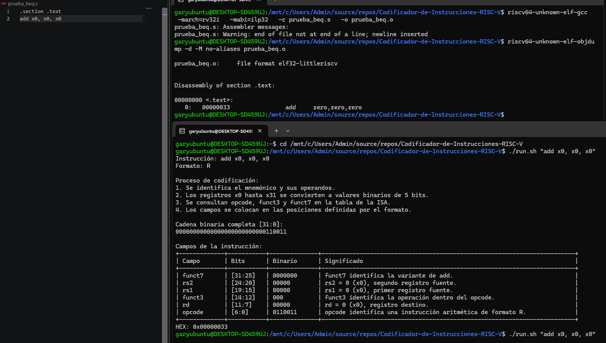

### Instruccion sub  
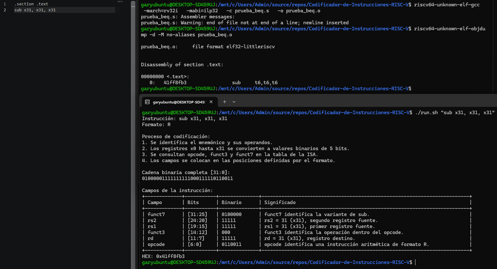  

### Instruccion and  
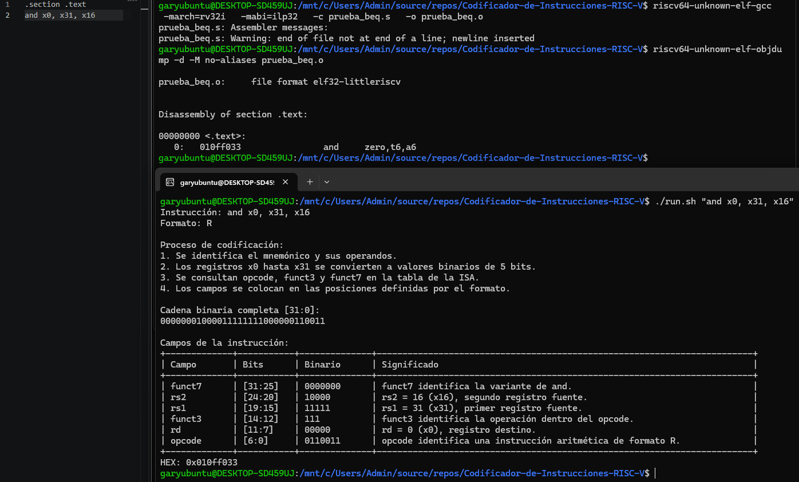  

### Instruccion or  
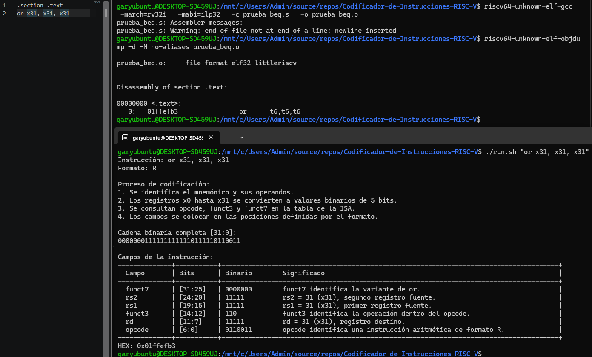  

### Instruccion addi  
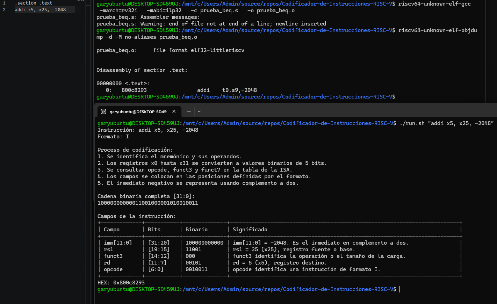  

### Instruccion andi  
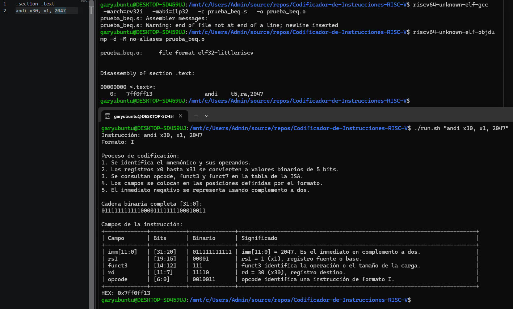  

### Instruccion lw  
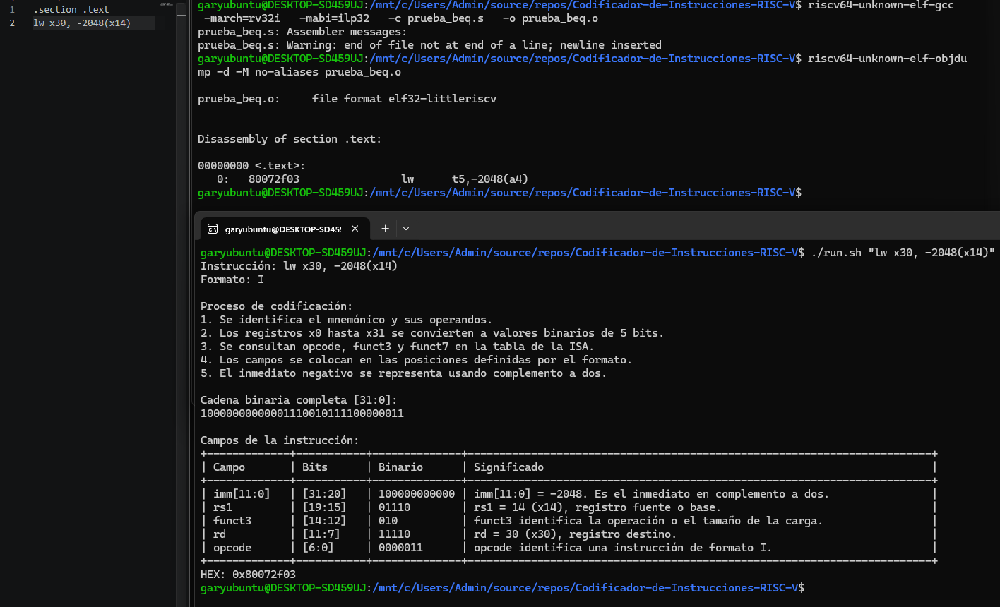  

### Instruccion lb  
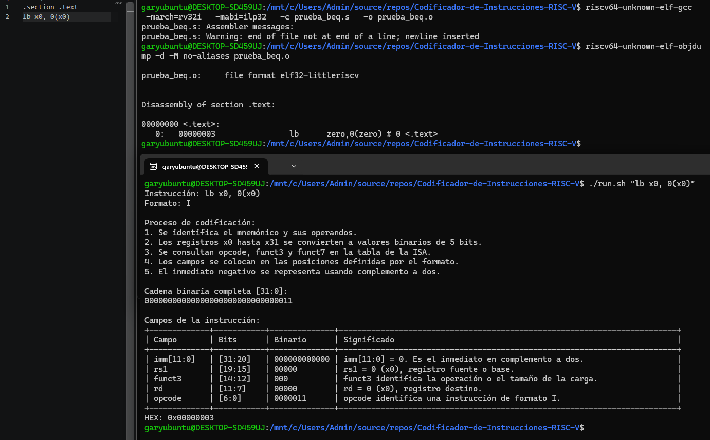  

### Instruccion sw  
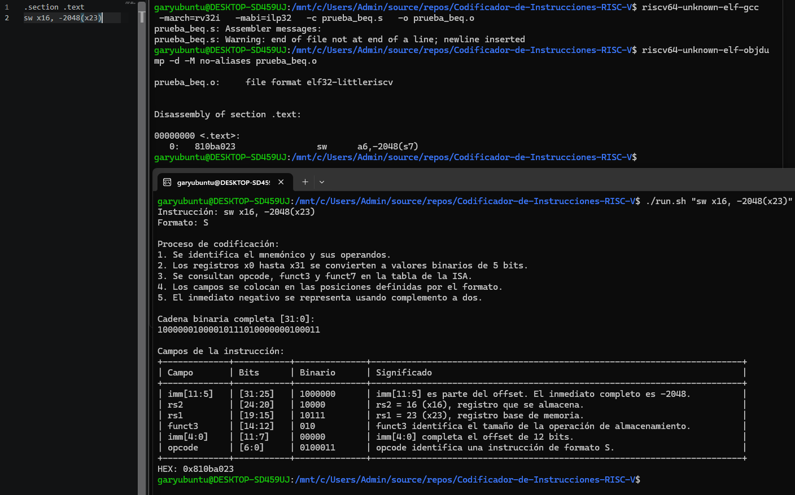  

### Instruccion sb  
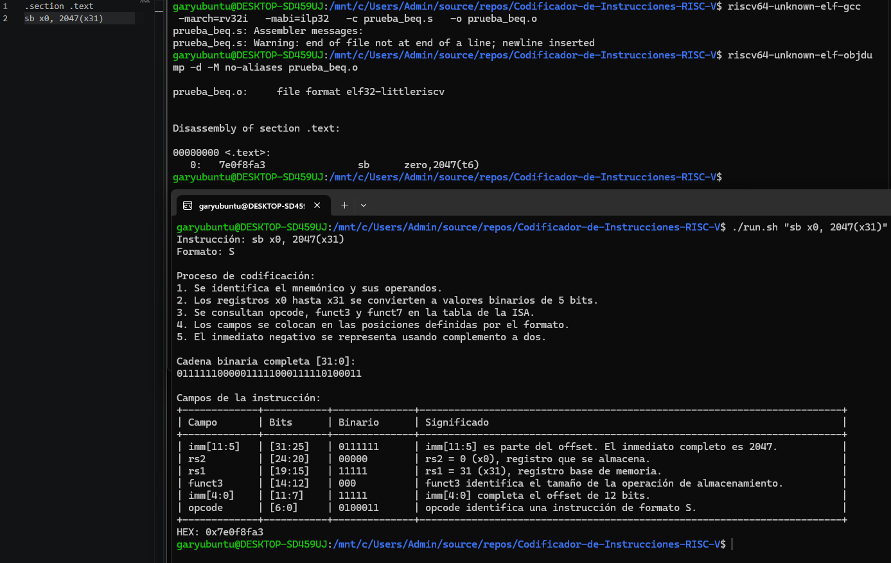  

### Instruccion beq  
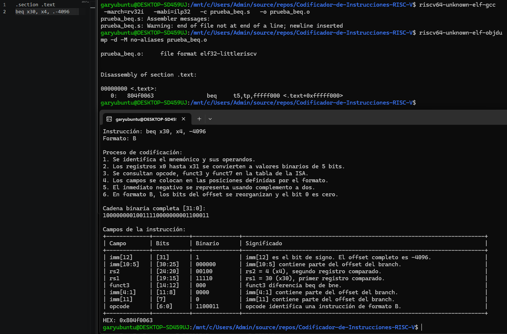  

### Instruccion bne  
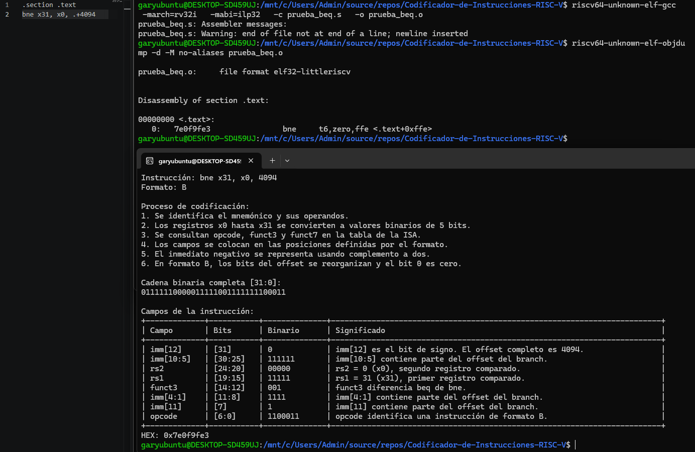  


## 5. Evidencia de la validación automática contra el toolchain oficial

La validación se realiza con `validate_toolchain.py`. El script prueba tres
casos por instrucción, para un total de 36 casos, y compara:

```text
resultado de ./run.sh  <->  resultado de objdump -d
```

Los archivos `.s` y `.o` se crean en una carpeta temporal. Al finalizar la
ejecución, esa carpeta se elimina automáticamente.

Para los branches, el script convierte internamente un offset numérico en
una expresión relativa aceptada por GNU assembler:

```text
16  -> .+16
-80 -> .-80
0   -> .+0
```

Esto evita que el assembler expanda el branch a una combinación de `bne` y
`jal`.

### Resultados

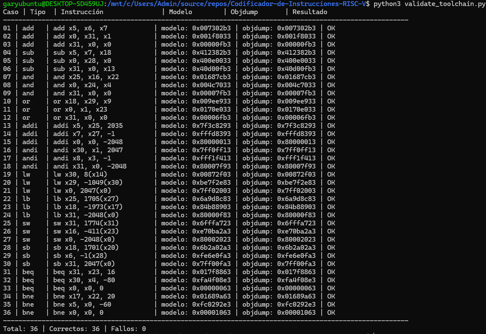

## 6. Instalación toolchain oficial

### 6.1 Instalación de la toolchain

La toolchain se instaló en WSL con:

```bash
sudo apt update
sudo apt install -y gcc-riscv64-unknown-elf python3 python3-pip git
```

La versión utilizada fue:

```text
riscv64-unknown-elf-gcc (14.2.0+19) 14.2.0
```

También se utiliza:

```text
riscv64-unknown-elf-objdump
```

### 6.2 Comandos utilizados en la validación manual

Para cada caso se creó un archivo ensamblador llamado `prueba_beq.s` con
una sola instrucción del subconjunto RV32I. Primero se generó el archivo
objeto con el siguiente comando:

```bash
riscv64-unknown-elf-gcc -march=rv32i -mabi=ilp32 -c prueba_beq.s -o prueba_beq.o
```

Este comando utiliza:

| Elemento | Función |
|---|---|
| `riscv64-unknown-elf-gcc` | Compilador de la toolchain RISC-V. |
| `-march=rv32i` | Ensambla utilizando la arquitectura RV32I. |
| `-mabi=ilp32` | Utiliza la ABI de 32 bits. |
| `-c` | Ensambla sin enlazar y genera un archivo objeto. |
| `prueba_beq.s` | Archivo de entrada con la instrucción ensamblador. |
| `-o prueba_beq.o` | Nombre del archivo objeto generado. |

Después se desensambló el archivo objeto para observar la codificación
generada por la toolchain oficial:

```bash
riscv64-unknown-elf-objdump -d -M no-aliases prueba_beq.o
```

En este comando:

| Elemento | Función |
|---|---|
| `riscv64-unknown-elf-objdump` | Herramienta para inspeccionar archivos objeto. |
| `-d` | Desensambla la sección de código. |
| `-M no-aliases` | Muestra las instrucciones sin alias en la representación textual. |
| `prueba_beq.o` | Archivo objeto que se desea inspeccionar. |

La salida contiene la palabra hexadecimal de 32 bits. Por ejemplo:

```text
0:  007302b3    add t0,t1,t2
```

El valor `007302b3` se comparó con la línea `HEX` producida por la
herramienta del proyecto.

En algunos casos puede aparecer el aviso:

```text
Warning: end of file not at end of a line; newline inserted
```

Este aviso indica que el archivo `.s` no tenía un salto de línea al final.
No cambia la codificación de la instrucción, pero se recomienda guardar el
archivo con una línea final para evitarlo.

Para ejecutar la herramienta propia y completar la comparación se utilizó:

```bash
./run.sh "add x5, x6, x7"
```

La comparación manual se realizó entre el valor hexadecimal de `objdump` y
el valor de la línea:

```text
HEX: 0xXXXXXXXX
```

